<div align='center'><h1 style=""color:#FF0000;">💻 MaixUI 📲</h1></div>

<br />
<br />

<div class="title_pic" align='center'>
       
</div>

<br />
<br />

<a href="https://travis-ci.org/sipeed/MaixUI">
    
</a>
<a href="https://github.com/sipeed/MaixUI/releases">
    
</a>
<a href="https://github.com/sipeed/MaixUI/blob/master/LICENSE.md">
    
</a>

<br />
<br />

**This is the MicroPython UI framework.**

- Decoration design
- Support layer drawing
- Support event-driven model
- Support event scheduling
- Support loading multiple applications and multiple pages
- No function overloading is required
- Provide basic framework examples & unit-test

Enjoy it! 🤡

> Note: MaixUI is not a collection of UI controls. It can provide a UI framework with high performance and low memory usage on MicroPython. Therefore, it will focus on integrating the stable code of the system, scheduling, application, event and other components, not just the UI page.

> 注意：MaixUI 不是一套 UI 控件的集合，它能够提供在 MicroPython 上的执行高性能与内存低占用的 UI 框架，因此会重点集成系统、调度、应用、事件等组件的稳定代码。

## Demo effect

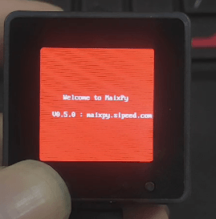
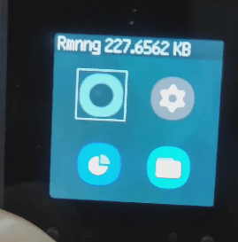
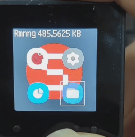


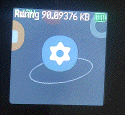
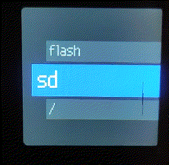
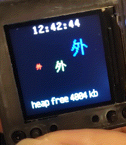

## Get-started

> 群里传送过来的朋友，可以通过 [usage.md](usage.md) 学习 MicroPython / MaixUI 开发方式。

#### run build_flash_fs.py

Use [/build_flash_fs.py](/build_flash_fs.py) to package all the files into fs folder and can move to Flash or SD card.

#### Select dependent modules to develop

Developers can sart from [ui/ui_canvas.py](ui/ui_canvas.py)

1. Ready a sipeed maix-cube (hardware) and flash [sipeed/maxipy](github.com/sipeed/maxipy).

2. Copy all files to SD card.

    - ui
    - res
    - lib
    - driver

3. Rename your [app/app_main.py](app/app_main.py) to `main.py`.

3. Move `main.py` to the root directory in SD card.

4. Boot from the SD card.


#### Currently supported startup applications.

- [app/app_main.py](app/app_main.py) (for other hardware)
- [app/app_cube.py](app/app_cube.py)
- [app/app_amigo.py](app/app_amigo.py)

## Architecture description

Explain with code.

### Core Execution

Let's look at pseudo-code.

```python

# such as agent
class agent:
  def run():
    exec(queue)
  def load(event)
    queue.push(event)

# old you can

class app:
  obj = agent()
  def init():
    obj.load(app.draw())
  def draw():
    pass
  def event()
    obj.run()

class demo:
  obj = agent()
  def init():
    obj.load(demo.draw())
  def draw():
    pass
  def event()
    obj.run()

# now you can

class core:
  obj = agent()
  def forever():
    obj.run()

class app:
  def init():
    core.obj.load(app.draw())
  def draw():
    pass
  
class demo:
  def init():
    core.obj.load(app.draw())
  def draw():
    pass
  
```

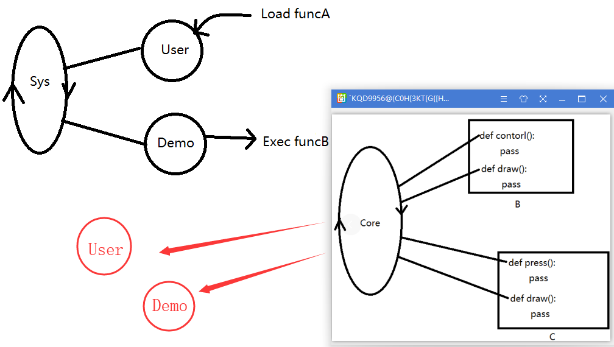

Up to you, more see [lib/core.py](lib/core.py) & [ui/ui_container.py](lib/ui_container.py).

### Layer drawing

Let's look at an example.

```python
  @ui.warp_template(ui.blank_draw) # first draw
  def app_main():
      # second draw
      ui.display() # third display
```

For example, implement a status(taskbar) bar base ui_canvas.ui.

```python

import time, gc

from ui_canvas import ui

class taskbar:

  now = ''

  def time_draw():
    now = 45678 + time.ticks() / 1000
    taskbar.now = time.localtime(int(now))
    ui.canvas.draw_string(60, 2, "%02u:%02u:%02u" % (taskbar.now[3], taskbar.now[4], taskbar.now[5]), scale=2)

  def mem_draw():
    info = 'GC %s KB' % str(gc.mem_free() / 1024)
    ui.canvas.draw_string(10, 2, info, scale=2)

if __name__ == "__main__":
    @ui.warp_template(ui.blank_draw)
    @ui.warp_template(ui.bg_in_draw)
    @ui.warp_template(taskbar.mem_draw)
    def app_main():
        ui.display()
    import time
    while True:
        app_main()
        #time.sleep(0.5)
```

This means that the taskbar(taskbar.mem_draw) is drawn after the background(ui.bg_draw) image is drawn.

look at this [ui/ui_taskbar.py](ui/ui_taskbar.py)

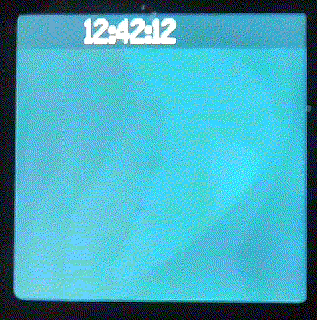

If you don't like to use decorators, you can choose to call actively, but pay attention to the order in which functions are called.

The following example。

```python
  def app_main():
      # first draw
      ui.blank_draw()
      # second draw
      ui.display() # third display
```

### Page design

The difference is that it can be used multiple times, so object-oriented design is required.

```python

class pages:

  def __init__(self):
    self.btn = sipeed_button()
    self.page_info = sys_info()
    self.page = 0

  def draw(self):
    self.btn.event()

    if self.btn.back() == 2:
        self.page -= 1
    elif self.btn.next() == 2:
        self.page += 1
    self.page = self.page % 3

    if self.page == 0:
      ui.canvas.draw_string(20, 30, "Weclome to MaixCube", (255, 255, 127), scale=2)
    if self.page == 1:
      self.page_info.draw(ui.canvas)
    if self.page == 2:
      ui.canvas.draw_string(40, 200, "Enjoy it! :D", (255, 0, 127), scale=2)

```

look at this [ui/ui_pages.py](ui/ui_pages.py)

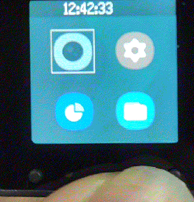

It is recommended to use app_main.py as a migration reference for other hardware, it will not contain external images.

Use this [app/app_main.py](app/app_main.py)

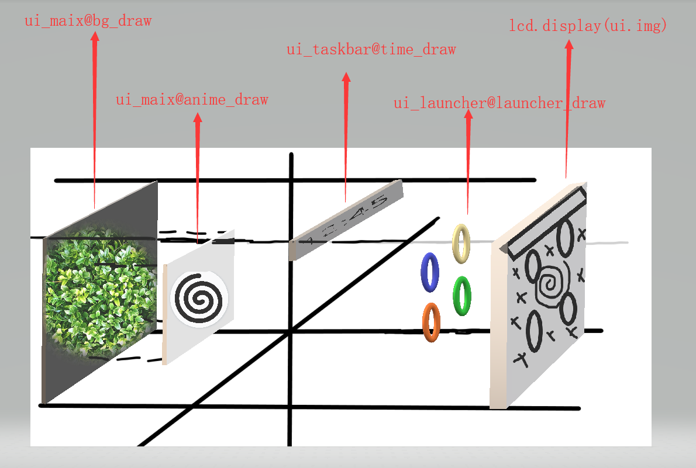

### Event-driven

Note that many events are not implemented for users to reload, in fact it is tailorable and not necessary.

> Please do not use the following design.

```python

class bar(frame):
  
  def on_button_press():  
    pass
  
  def on_button_release():
    pass

```

For example, our button driver realizes the event of pressing and releasing, and can give any function to actively access the button event.

> Now Configure IO function through button_io.config().

```python

class bar(frame):

  btn = button()

  def draw(): # Cycle run

    bar.btn.event() # It can be performed elsewhere.

    if bar.btn.next() = 1: # button press
      pass
    if bar.btn.back() = 2: # button release
      pass
    if bar.btn.home():
      pass

```

Similarly other.

look at this [driver/button.py](driver/button.py)


### driver programming (Singleton-Class)

Simple can be written like this.

```python
import sys, time
import sensor, lcd

class obj:

    is_init = False

    def init():
      pass

    def get_image():
        if obj.is_init == False:
            obj.init()
            obj.is_init = True
        return sensor.snapshot()

if __name__ == "__main__":
    pass
```

look at this [driver/camera.py](driver/camera.py)


### Unit-Test

Please make sure that each code can be unit tested.

```python

class test:

    def hello():
      pass

if __name__ == "__main__":
    test.hello()

```

This also facilitates the splitting of components, which facilitates independent commissioning and optimization.

### Optimization

Control memory usage and refresh rate.

#### FPS

- Compatible with CPython

```python

  import time
  last = time.ticks_ms()
  while True:
      try:
          print(time.ticks_ms() - last)
          last = time.ticks_ms()
          your_func()
      except Exception as e:
          print(e)

```

- MaixPy only

```python

  clock = time.clock()
  while(True):
      clock.tick()
      lcd.display(get_image())
      print(clock.fps())
      print('ram total : ' + str(gc.mem_free() / 1024) + ' kb')
      kpu.memtest()

```

#### View remaining memory

```python

def print_mem_free():
    print('ram total : ' + str(gc.mem_free() / 1024) + ' kb')

import gc, image

print_mem_free()

tmp = ' '*4096

print_mem_free()

del tmp

print_mem_free()

'''
ram total : 989.4375 kb
ram total : 985.0625 kb
ram total : 984.8437 kb
'''

```

Next up to you.

## Performance statistics

> 20200910 The following information is out of date

Now! Run this [app/app_main.py](app/app_main.py) up 30 fps.


Record the time and memory usage of each component.

- ui_canvas.py
  - bg_draw
  - anime_draw
  - system_info
  - taskbar
  - need 49ms (19 ~ 23fps)
  - need mem 760kb

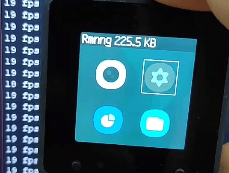

- app_micro.py
  - bg_in_draw
  - anime_in_draw
  - system_info
  - taskbar
  - need 30 ~ 51ms (24 ~ 42fps)
  - need mem 330kb


## Precautions

请注意组件可重用性和绘图性能测试，必须保证每个模块均有开发过程产生的单元测试。

Please note that component reusability and graphics performance testing must ensure that each module has unit tests generated during the development process.

请确保页面只是对 UI 元素的描述和交互，所以可以在页面交互逻辑中实现业务逻辑、绘图逻辑，但不允许存在硬件驱动逻辑，这也是为了在 CPython 里同步实现。

Please ensure that the page is only the description and interaction of UI elements, so you can implement business logic and drawing logic in the page interaction logic, but there is no hardware driving logic allowed. This is also for synchronous implementation in CPython.

## Contributing

Feel free to dive in! [Open an issue](https://github.com/sipeed/MaixUI/issues/new) or submit PRs.

Source archive to [Releases](https://github.com/sipeed/MaixUI/releases)

### Contributors

This project exists thanks to all the people who contribute. 

There will be later.

## License

[MIT](LICENSE) © Richard Littauer
